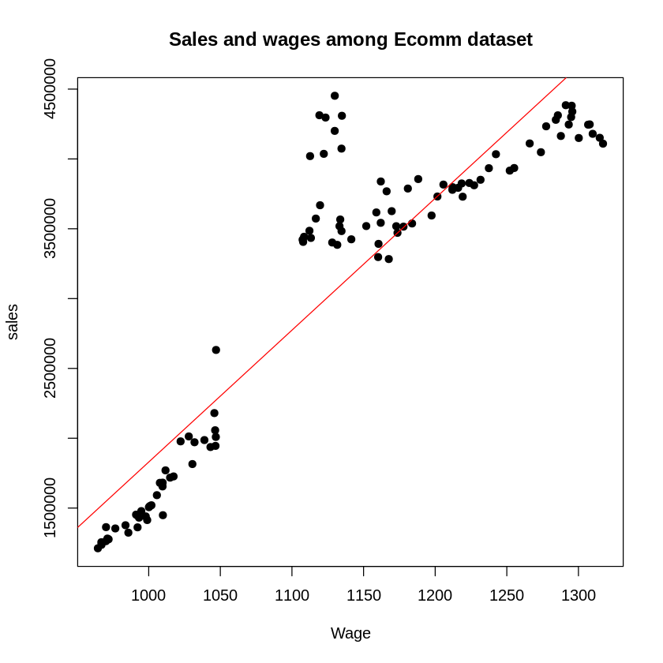
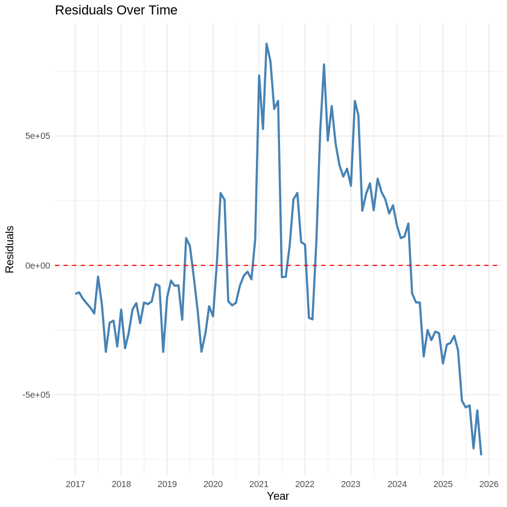

## Canadian E-Commerce Econometrics Analysis (2017–2025)

Statistical analysis and econometric modeling project examining how labor market conditions, wages, and inflation influence Canadian retail e-commerce sales using seasonally adjusted monthly data from Statistics Canada.

### Project Overview
This project analyzes the relationship between Canadian retail e-commerce sales and key macroeconomic indicators including employment rate, wages, and inflation (CPI). Multiple econometric models were developed and evaluated using time-series data covering January 2017 to December 2025. The analysis includes OLS regression modelling, heteroskedasticity testing, autocorrelation diagnostics, robust standard errors, log-log elasticity models, and fixed effects regression to evaluate the reliability and economic significance of the relationships.

### Highlights
- Analyzed 107 monthly observations of Canadian economic and retail e-commerce data
- Built and evaluated multiple OLS regression models in R - Conducted hypothesis testing, heteroskedasticity testing, and autocorrelation diagnostics - Applied robust standard errors (HC0/FGLS) to improve model reliability
- Developed log-log elasticity models to measure economic sensitivity
- Implemented year fixed effects to control for time-specific shocks and macroeconomic changes
- Visualized model diagnostics and economic trends using statistical plots and time-series analysis
 
### Key Findings
- Wages demonstrated a strong positive relationship with e-commerce sales growth
- Inflation (CPI) showed a statistically significant negative impact on online retail spending
- Employment rate showed limited statistical significance across several model variations
- The analysis identified heteroskedasticity and strong positive autocorrelation within residuals
- Fixed effects modelling highlighted significant growth in e-commerce sales during and after the COVID-19 pandemic period

### Statistical Methods
- Ordinary Least Squares (OLS) Regression 
- F-Test for Joint Significance
- Breusch-Pagan Test for Heteroskedasticity
- Durbin-Watson Test for Autocorrelation
- Robust Standard Errors (HC0)
- Log-Log Elasticity Modelling
- Fixed Effects Regression

<h3>Key Visualizations</h3>

<table>
  <tr>
    <td align="center">
      
       <b>Residuals plot to detect heteroskedasticity</b>
    </td>
    <td align="center">
      
       <b>Residuals overtime</b>
    </td>
  </tr>

 
</table>

### Tools & Skills
R, Econometrics, OLS Regression, Time-Series Analysis, Statistical Modelling, Data Visualization, Hypothesis Testing, Robust Standard Errors, Fixed Effects Models

### Note
This project demonstrates the application of econometric and time-series analysis techniques commonly used in economic research, business intelligence, and data-driven decision-making to evaluate the relationship between macroeconomic indicators and retail e-commerce performance.
